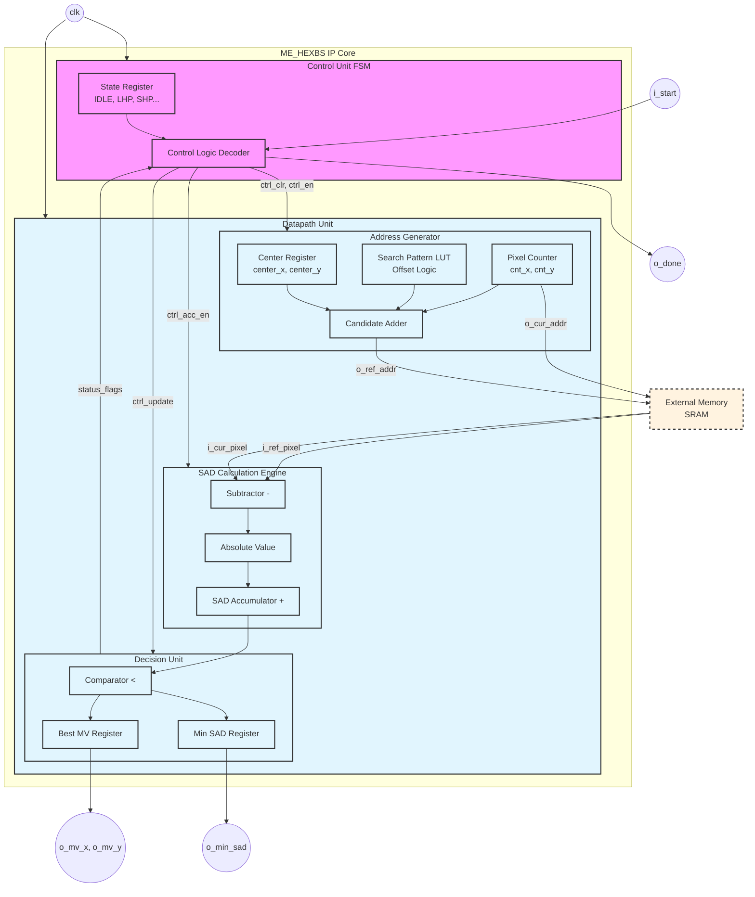

# **ME\_HEXBS Hardware Architecture**

此文件描述了 Hexagon-Based Search (HEXBS) Motion Estimation 加速器的硬體架構。

## **Block Diagram**

```mermaid
%%{init: {'theme': 'default'}}%%
graph TD
    %% 定義樣式
    classDef control fill:#f9f,stroke:#333,stroke-width:2px;
    classDef datapath fill:#e1f5fe,stroke:#333,stroke-width:2px;
    classDef memory fill:#fff3e0,stroke:#333,stroke-width:2px,stroke-dasharray: 5 5;

    subgraph Top_Level [ME_HEXBS IP Core]
        direction LR

        %% --- Control Unit FSM ---  
        subgraph Control_Unit [Control Unit FSM]
            direction TB
            FSM_State[State Register<br/>IDLE, LHP, SHP...]
            Control_Logic[Control Logic Decoder]
            FSM_State --> Control_Logic
        end

        %% --- Datapath ---  
        subgraph Datapath [Datapath Unit]
            direction TB

            %% Address Generation  
            subgraph Addr_Gen [Address Generator]
                Center_Reg[Center Register<br/>center_x, center_y]
                Offset_LUT[Search Pattern LUT<br/>Offset Logic]
                Pixel_Cnt[Pixel Counter<br/>cnt_x, cnt_y]
                Cand_Adder[Candidate Adder]
                Center_Reg --> Cand_Adder
                Offset_LUT --> Cand_Adder
            end

            %% Calculation Engine  
            subgraph SAD_Engine [SAD Calculation Engine]
                Subtractor[Subtractor -]
                Abs[Absolute Value]
                Accumulator[SAD Accumulator +]
                Subtractor --> Abs --> Accumulator
            end

            %% Decision  
            subgraph Decision_Logic [Decision Unit]
                Comparator[Comparator <]
                Min_SAD_Reg[Min SAD Register]
                Best_MV_Reg[Best MV Register]
                Comparator --> Min_SAD_Reg
                Comparator --> Best_MV_Reg
            end
        end
    end

    %% --- External Memory Environment ---  
    Ext_Mem[External Memory<br/>SRAM]

    %% --- Connections ---  
    %% Inputs  
    Clk((clk)) --> Control_Unit
    Clk --> Datapath
    Start((i_start)) --> Control_Logic

    %% Control Signals Internal  
    Control_Logic -- ctrl_clr, ctrl_en --> Addr_Gen
    Control_Logic -- ctrl_acc_en --> SAD_Engine
    Control_Logic -- ctrl_update --> Decision_Logic
    Decision_Logic -- status_flags --> Control_Logic

    %% Data Flow  
    Cand_Adder -- o_ref_addr --> Ext_Mem
    Pixel_Cnt -- o_cur_addr --> Ext_Mem

    Ext_Mem -- i_ref_pixel --> Subtractor
    Ext_Mem -- i_cur_pixel --> Subtractor

    Accumulator --> Comparator
    Pixel_Cnt --> Cand_Adder

    %% Outputs  
    Best_MV_Reg --> Output_MV((o_mv_x, o_mv_y))
    Min_SAD_Reg --> Output_SAD((o_min_sad))
    Control_Logic --> Output_Done((o_done))

    %% Styles  
    class Control_Unit,FSM_State,Control_Logic control;
    class Datapath,Addr_Gen,SAD_Engine,Decision_Logic,Center_Reg,Offset_LUT,Pixel_Cnt,Cand_Adder,Subtractor,Abs,Accumulator,Comparator,Min_SAD_Reg,Best_MV_Reg datapath;
    class Ext_Mem memory;
```
